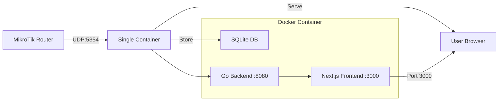

# 🔍 MikroTik DNS Analytics

> Modern real-time DNS analytics dashboard for MikroTik routers with beautiful web interface


A comprehensive DNS analytics solution that receives DNS logs from MikroTik routers via UDP, stores them in SQLite, and presents beautiful real-time statistics through a modern React dashboard.


---

## ✨ Features

### 🎯 **Modern Dashboard**

- **Real-time Statistics**: Auto-refreshing dashboard with customizable intervals (5s-5min)
- **Modern UI**: Next.js 15 + React 19 with Tailwind CSS and Radix UI components
- **Responsive Design**: Works perfectly on desktop, tablet, and mobile devices
- **Animated Numbers**: Smooth transitions when data updates
- **Interactive Elements**: Click-to-copy functionality throughout the interface

### 📊 **Comprehensive Analytics**

- **Overview Page**: Modern cards with gradients, IPv4 vs IPv6 adoption, query rates
- **Top Domains**: Visual ranking with progress bars and interactive selection
- **PSL Domain Groups**: Group subdomains by registrable domain, including suffixes such as `.com.cn` and `.co.jp`
- **Client Analysis**: Most active clients with detailed query history
- **Unified Query Search**: Exact, suffix, and contains matching with advanced filters
- **Query Types**: Distribution analysis with special highlighting for unknown queries
- **Network Insights**: Query rates, resolution success rates, client distribution

### 🔧 **Advanced Functionality**

- **Domain → Clients**: Click any domain to see which clients are querying it
- **Client → Domains**: Click any client to see their query history
- **IPv4/IPv6 Tracking**: Monitor protocol adoption in your network
- **Failed Query Analysis**: Identify and troubleshoot DNS resolution issues
- **Real-time Metrics**: Queries per minute, active clients, unique domains

### 🚀 **Production Ready**

- **Docker Containerized**: Complete containerization with Docker Compose
- **API Proxy**: Single port deployment (3000) with backend proxying
- **Optimized Backend**: Efficient Go API with SQLite and proper CORS
- **Configurable retention**: Automatically removes expired data (24 hours by default)
- **Error Handling**: Robust error handling and null-safe operations

---

## 🏃‍♂️ Quick Start

### 1. Using Docker Compose (Recommended)

```bash
# Clone the repository
git clone https://github.com/publi0/mikrotik-dns.git
cd mikrotik-dns

# Start with Docker Compose
docker compose up -d

# View logs
docker compose logs -f
```

### 2. Using Docker Run Directly

```bash
# Pull and run the pre-built image
docker run -d \
  --name mikrotik-dns \
  --restart unless-stopped \
  -p 3000:3000 \
  -p 5354:5354/udp \
  -v $(pwd)/data:/data \
  ghcr.io/publi0/mikrotik-dns:latest

# View logs
docker logs -f mikrotik-dns
```

### 3. Using Deployment Script

```bash
# Use the provided deployment script
./deploy-example.sh
```

**Access the dashboard:**

- 🌐 **Web Dashboard**: http://localhost:3000
- 📡 **UDP Logs**: Port 5354 (for MikroTik)

### 4. Using Makefile

```bash
# Check if all tools are available
make check-tools

# Build and start single image
make single-build
make single-up

# View real-time logs
make single-logs

# Stop services
make single-down
```

---

## 📡 MikroTik Configuration

Configure your MikroTik router to send DNS logs:

The receiver accepts RouterOS `syslog` remote logs with BSD or ISO 8601
timestamps. ISO 8601 is recommended. RouterOS `default` and CEF remote formats
are not parsed; their original lines are still retained in the raw-log store.

### Option 1: WebFig/Winbox GUI

1. Go to **System → Logging**
2. Configure the `remote` action:
   - **Remote Address**: `<your_server_ip>`
   - **Remote Port**: `5354`
   - **Remote Log Format**: `syslog`
   - **Syslog Time Format**: `iso8601`
3. Add a new rule:
   - **Topics**: `dns,!packet`
   - **Action**: `remote`

### Option 2: Command Line Interface

```shell
/system logging action set [find where name="remote"] remote=<your_server_ip> remote-port=5354 remote-log-format=syslog syslog-time-format=iso8601
/system logging add topics=dns,!packet action=remote
```

### Expected Log Format

```
<30>2025-01-15T14:23:45Z router dns,info dns query from 192.168.1.100: #12345 google.com. A
<30>2025-01-15T14:23:45Z router dns,info dns done query: #12345 google.com 142.250.72.14
<30>Jan 15 14:23:46 router dns,info dns local query: #12346 cloud.mikrotik.com. AAAA
```

The receiver stores query IDs, local router queries, and the raw completion
message. Packet-level `dns,packet` debug output is intentionally excluded; its
multi-line packet dump is not part of the query log format supported here.

---

## 🏗️ Architecture



## 📊 API Endpoints

### Core Statistics

- `GET /api/top-domains` - Most queried domains
- `GET /api/top-domain-groups` - Most queried registrable domains using the Public Suffix List
- `GET /api/domain-group-members?group=<domain>&page=1` - Full domains within a registrable domain group
- `GET /api/query-types` - DNS query type distribution
- `GET /api/clients` - Most active client IPs
- `GET /api/unique-clients-count` - Count of unique clients
- `GET /api/unique-domains-count` - Count of unique domains

### Advanced Analytics

- `GET /api/queries-per-minute` - Average queries per minute
- `GET /api/ipv4-vs-ipv6` - IPv4 vs IPv6 usage statistics
- `GET /api/queries?page=1&domain=example.com&domain_mode=suffix` - Paginated query history with exact, suffix, or contains matching and advanced filters
- `GET /api/raw-logs?from=<unix>&to=<unix>&limit=<optional>` - Download retained source logs as JSONL

### Interactive Features

- `GET /api/client-queries?client=<ip>&page=1` - Queries from specific client
- `GET /api/domain-clients?domain=<domain>&suffix=true&page=1` - Clients querying a domain, optionally including all subdomains

---

## 🎨 Dashboard Features

### Overview Page

- **Modern Gradient Cards**: Beautiful statistics with color-coded themes
- **IPv4/IPv6 Adoption**: Visual progress bars showing protocol usage
- **Network Health**: Resolution success rates and query performance
- **Real-time Metrics**: Live query rates and client distribution

### Domains Page

- **Interactive Domain List**: Click any domain to see client details
- **Client Analysis**: Shows which clients query specific domains
- **Query Counts**: Number of queries per client for selected domain
- **Last Activity**: Timestamp of most recent query

### Clients Page

- **Active Client Ranking**: Most active IP addresses
- **Query History**: Detailed query log for each client
- **Domain Breakdown**: What domains each client is accessing

### Queries Page

- **Unified Search**: Domain contains, exact, and label-safe suffix matching
- **Advanced Filters**: Client, query type, RouterOS query ID, and time range
- **Query Details**: Click a row to inspect query/completion times, PSL domain, query ID, and raw RouterOS result
- **Live DNS Resolution**: Re-run the selected query type from the details dialog
- **Raw Log Export**: Download original UDP lines as JSONL for debugging; the selected From/To values define the export segment

---

## ⚙️ Configuration

### Environment Variables

- `BACKEND_URL`: Internal backend URL for API proxy (default: `http://mikrotik-dns-backend:8080`)
- `DATABASE_PATH`: SQLite database location (default: `/data/queries.db`)
- `DATA_RETENTION_HOURS`: Number of hours retained and shown in analytics (default: `24`, positive integers only)
- `DNS_SERVER`: Custom DNS server for resolution testing (optional, uses system default if not set)

### Auto-refresh Settings

- **5 seconds**: Real-time monitoring
- **10 seconds**: Active monitoring
- **30 seconds**: Regular updates
- **1 minute**: Casual monitoring
- **5 minutes**: Background monitoring

---

## 🔧 Development

### Local Development

```bash
# Backend
go mod tidy
go run .

# Frontend (in separate terminal)
cd page
npm install
npm run dev
```

### Building from Source

```bash
# Backend
CGO_ENABLED=1 go build -o mikrotik-dns .

# Frontend
cd page
npm run build
```

---

## 📦 Docker Configuration

### Single Image Deployment

The application is available as a single Docker image with both frontend and backend:

```yaml
# docker-compose.yml
services:
  mikrotik-dns:
    image: ghcr.io/publi0/mikrotik-dns:latest
    container_name: mikrotik-dns
    restart: unless-stopped
    ports:
      - "3000:3000" # Web dashboard
      - "5354:5354/udp" # MikroTik logs
    volumes:
      - ./data:/data
    environment:
      - DNS_SERVER=${DNS_SERVER:-}
      - DATABASE_PATH=/data/queries.db
      - DATA_RETENTION_HOURS=${DATA_RETENTION_HOURS:-24}
      - PORT=3000
      - NODE_ENV=production
    healthcheck:
      test: ["CMD", "wget", "-qO-", "http://127.0.0.1:3000"]
      interval: 30s
      timeout: 5s
      retries: 3
      start_period: 10s
```

### Environment Variables

- `DATABASE_PATH`: SQLite database location (default: `/data/queries.db`)
- `DATA_RETENTION_HOURS`: Number of hours retained and shown in analytics (default: `24`)
- `DNS_SERVER`: Custom DNS server for resolution testing (optional)
- `PORT`: Frontend port (default: `3000`)
- `NODE_ENV`: Node.js environment (default: `production`)

---

## 🗄️ Database Schema

SQLite database with configurable automatic cleanup and indexes for time-window, domain, and client queries. Database migrations are intentionally not provided; remove or recreate a database created by an older release before starting this version.

```sql
CREATE TABLE queries (
    id INTEGER PRIMARY KEY,
    timestamp INTEGER NOT NULL,
    client TEXT NOT NULL,
    domain TEXT NOT NULL,
    type TEXT NOT NULL,
    query_id INTEGER NOT NULL,
    result TEXT,
    completed_at INTEGER,
    source TEXT NOT NULL,
    reverse_domain TEXT NOT NULL
);

CREATE TABLE raw_logs (
    id INTEGER PRIMARY KEY,
    received_at INTEGER NOT NULL,
    source TEXT NOT NULL,
    message TEXT NOT NULL
);

CREATE INDEX idx_queries_timestamp ON queries(timestamp);
CREATE INDEX idx_queries_domain_timestamp_client ON queries(domain COLLATE NOCASE, timestamp, client);
CREATE INDEX idx_queries_client_timestamp ON queries(client, timestamp);
CREATE INDEX idx_queries_reverse_domain_timestamp ON queries(reverse_domain, timestamp);
CREATE INDEX idx_queries_source_query_id_timestamp ON queries(source, query_id, timestamp);
CREATE INDEX idx_raw_logs_received_at ON raw_logs(received_at);
```

Raw logs use the same `DATA_RETENTION_HOURS` cleanup window as parsed queries.
They preserve the complete received line, including the syslog envelope, even
when the DNS parser does not recognize the message.

---

## 🐛 Troubleshooting

### No Data Appearing

1. Check MikroTik logging configuration
2. Verify UDP port 5354 is accessible
3. Check container logs: `docker compose logs -f`
4. Download a raw-log segment from the Queries page to inspect the exact RouterOS format

### DNS Resolution Issues

- Monitor "Failed Queries" card for UNKNOWN query types
- Check "Resolution Rate" in Activity Summary
- Open a query's details and use **Resolve now** to investigate specific issues

### Performance Issues

- Monitor "Query Rate" metrics
- Check "Avg. per Client" statistics
- Review IPv4/IPv6 distribution for network optimization

### Build Issues

- Ensure CGO is enabled for SQLite support
- Check Docker build context includes all necessary files
- Verify Node.js dependencies are properly installed

---

## 🤝 Contributing

1. Fork the repository
2. Create a feature branch: `git checkout -b feature/amazing-feature`
3. Commit changes: `git commit -m 'Add amazing feature'`
4. Push to branch: `git push origin feature/amazing-feature`
5. Open a Pull Request

---

## 📄 License

This project is licensed under the MIT License - see the [LICENSE](LICENSE) file for details.

---

## 🙏 Acknowledgments

- **MikroTik**: For excellent router hardware and logging capabilities
- **Go**: For the efficient backend implementation
- **Next.js & React**: For the modern frontend framework
- **Tailwind CSS**: For the beautiful and responsive design
- **Radix UI**: For accessible and customizable components
- **SQLite**: For the lightweight and reliable database

---

<div align="center">

Made with ❤️ for network administrators and DNS enthusiasts

</div>
